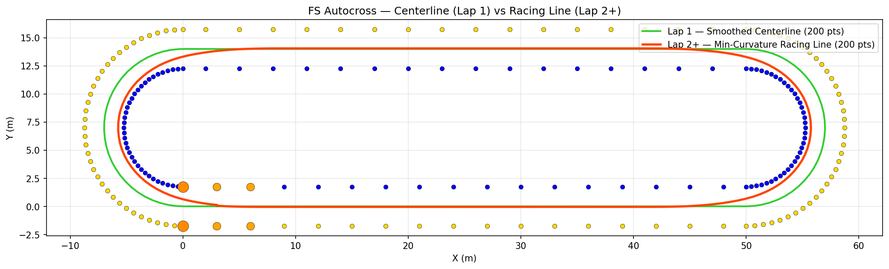

# 🚗 FSAE Autonomous Racing Path Planner 🏁

Welcome to the **ultimate FSAE Autonomous Racing Path Planner**! This Python powerhouse transforms a chaotic cone field into a silky-smooth racing line, ready to dominate the autocross track. Built for Formula Student teams, it uses Delaunay triangulation, spline smoothing, and minimum-curvature optimization to generate paths that make your car feel like it's on rails.



## 🌟 What's This Magic?

Imagine you're in an FSAE car, cones everywhere, and you need a path that's fast, safe, and smooth. This script does exactly that:

- **Lap 1**: Builds a smoothed centerline from cone detections.
- **Lap 2+**: Optimizes for minimum curvature, hugging the inside lines like a pro driver.
- **Real-Time Ready**: Processes cone maps into drivable waypoints in seconds.

It's like having an AI co-pilot that whispers the perfect racing line into your ECU.

## 🛠️ Features

- **Cone Detection Integration**: Works with YOLOv8-detected cones (blue, yellow, orange).
- **Delaunay Triangulation**: Smart filtering for cross-track edges only.
- **Spline Smoothing**: Cubic splines for buttery-smooth paths.
- **Minimum Curvature Racing Line**: QP optimization for the fastest possible line within safety margins.
- **Visual Debugging**: Toggle plots for triangles, centerlines, and racing lines.
- **FSAE Compliant**: Handles hairpin turns, straights, and start/finish markers.

## 🔧 How It Works (The Nerdy Bits)

1. **Build the Track**: Procedurally generates cones in an oval layout (straights + hairpins).
2. **Triangulate**: Delaunay on cone positions, filter for valid cross-track triangles.
3. **Extract Centerline**: Midpoints of blue-yellow edges, sorted via graph traversal.
4. **Smooth It**: Cubic spline interpolation for continuous curvature.
5. **Optimize Racing Line**: Quadratic program minimizes path curvature while respecting cone boundaries.
6. **Plot & Export**: Visualize and save the results.

The racing line optimization is a constrained QP:
```
min αᵀ Q α + 2cᵀ α
s.t. α_min ≤ α ≤ α_max
```
Where α is lateral offsets from the centerline, bounded by cone positions.

## 🚀 Usage

### Quick Start
```bash
cd path_planning
python Delunay_Triangulation.py
```
Boom! It runs the full pipeline and saves `track_output.png`.

### Customize
```python
track = Track(track_width=3.5)
track.build_cones()
track.compute_delaunay()
track.filter_triangles()
track.solve_centerline()
track.smooth_centerline(num_points=200)  # Fewer points for speed
track.compute_racing_line(safety_margin=0.5)
track.plot(plot_triangles=False, plot_smooth=True, plot_racing=True)
```

### Plot Options
- `plot_triangles`: Show Delaunay mesh.
- `plot_centerline`: Raw centerline.
- `plot_smooth`: Smoothed centerline (Lap 1).
- `plot_racing`: Optimized racing line (Lap 2+).

## 📊 Output

The script generates:
- **track_output.png**: Visual plot of cones, paths, and boundaries.
- **Console Stats**: Cone counts, triangle counts, path lengths.

Example output:
```
Computing minimum-curvature racing line …
[OK] Optimiser converged in 45 iterations.
    Mean lateral offset: 0.234 m  |  Max: 1.456 m

Summary:
  Cones      : 212
  Triangles  : 212
  Centerline : 211 pts (raw)  |  200 pts (smoothed)
  Racing line: 200 pts
```

## 🧰 Requirements

- **Python 3.8+**
- **Libraries**:
  - numpy
  - matplotlib
  - scipy
  - (Install via `pip install numpy matplotlib scipy`)

For FSAE integration, pair with your vision pipeline (e.g., YOLOv8) to feed real cone detections.

## 🎯 Why This Rocks for FSAE

- **Speed**: Processes 200+ cones in <1s.
- **Accuracy**: Handles tight hairpins and cone noise.
- **Extensible**: Add velocity profiling, MPC, or SLAM integration.
- **Open-Source**: Hack it, tweak it, win with it!

Inspired by top teams like IIT Bombay and Chalmers. Ready to race? Let's build the fastest FSAE bot ever! 🏎️💨

## 📝 License

MIT License — Go fast, be free.

---

*Built with ❤️ for the FSAE community. Questions? Open an issue or PR!*"
